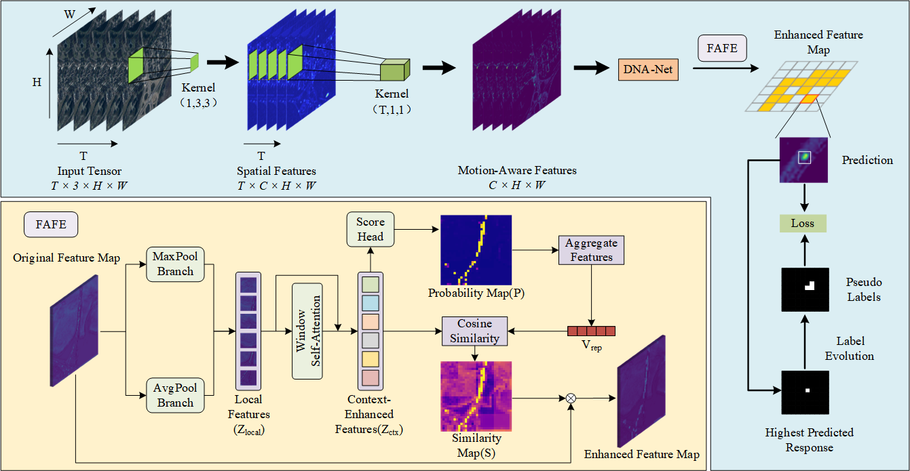

# PLE-NET


# Algorithm Introduction
we propose the Prediction-Aware Label Evolution Network (PLE-Net). First, we construct a spatiotemporal enhanced backbone to effectively capture motion cues. Second, a region-aware attention mechanism is designed to augment foreground feature represen-tation. Finally, motivated by an analysis of centroid supervision efficacy, we introduce a dynamic label evolution strategy. This strategy employs a diffusion mechanism to facilitate label growth during training, thereby providing precise pixel-level supervision for the objects. Extensive experiments on the VISO benchmark demonstrate that our method achieves an F1 score of 88.0%.

# Usage
## On Ubuntu
### 1. Training on a single GPU
```
python train.py configs/plenet.py
```
### 2. Training on multiple GPUs
```
./dist_train.sh configs/plenet.py <your_gpu_num>
```
### 2. Test on a single GPUs
```
python multi_frame_test.py configs/plenet.py <权重路径> --eval\out\...(详情参考mmdet可以执行的命令)
```
### eval
```
python hieum_eval_.py
```
# Data
The dataset comes from VISO, with the test dataset being a relabeled version of Hieum's dataset. you can download it from [github](https://github.com/ChaoXiao12/Moving-object-detection-in-satellite-videos-HiEUM/tree/main) Thanks to Xiao. 
The trained weight and test result is available at [BaiduYun]()(Sharing code: ). You can download the model and put it to the weights folder.
